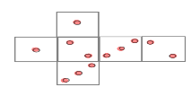
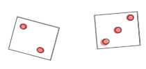
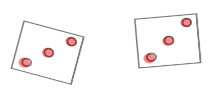
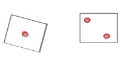

# Random events and probability - a short review 

<!--In the first statistics course, you learned how to summarize, visualize and analyze the data from an **existing** sample (from a partial survey, i.e.) into one or more characteristics. However, our goal has not yet been achieved at this point, because what we should *really* strive for are valid **conclusions** about the distribution in the population based on this **sample realization**. It is currently not clear:

- whether such conclusions are even permissible,
- and if so, what do you have to take into account?
- Which key figures from Part I provide information about which parameters of the population and
- why did we calculate the key figures the way we calculated them? (where do the formulas come from?)

In order to answer these and other questions in this regard, we must first understand how such a possible sample realization can be modeled as the result of a **random selection** from a population, i.e. a **random process**.
-->

```{js, echo=F}
function checkAnswer_mmc(q) {
      const selectedOptions = document.querySelectorAll('input[name="option'+q.id+'"]:checked');
      if (selectedOptions.length === 2) {
        const userAnswers = Array.from(selectedOptions).map(option => option.value);
        const correctAnswers = q.answer;
        const isCorrect = userAnswers.every(answer => correctAnswers.includes(answer));

if (isCorrect) {
          document.getElementById('result'+q.id).textContent = 'Congratulations! Your answer is correct.';
        } else {
          document.getElementById('result'+q.id).textContent = `Sorry, incorrect.`;
        }
      } else {
        document.getElementById('result'+q.id).textContent = 'Please select two options.';
      }
    }
// numeric
function generateQuestion_num(id) {
      // Generate two random numbers between 2 and 10
      const num1 = Math.floor(Math.random() * 10) + 2;
      const num2 = Math.floor(Math.random() * 10) + 2;
      const x1 = Math.floor(Math.random() * 100) + 2;
      const x2 = Math.floor(Math.random() * 100) + 2;
      const x3 = Math.floor(Math.random() * 100) + 2;
      const x4 = Math.floor(Math.random() * 100) + 2;
      const x5 = Math.floor(Math.random() * 100) + 2;
      const x6 = Math.floor(Math.random() * 100) + 2;

       // Calculate the correct answer
      let answer = num1*Math.sqrt(x1) + num2*Math.sqrt(x2);


      // Return the question and answer as an object
      return {
       // question: num1 + "\\(\\sqrt{x}+\\)"+ num2 + "\\(\\sqrt{y}\\)" + " for \\(x=\\)" + x1 + " and \\(y=\\)" + x2,
        question: [num1,num2,x1,x2,x3,x4,x5,x6],
        answer: answer,
        id: id
      };
    }

function checkAnswer_num(q) {
      const userAnswer = document.getElementById('answer'+q.id).value;
      const isCorrect = Math.round(parseFloat(userAnswer)*100)/100 === Math.round(q.answer*100)/100;

      if (isCorrect) {
        document.getElementById('result'+q.id).textContent = 'Congratulations! Your answer is correct.';
      } else {
        document.getElementById('result'+q.id).textContent = `Sorry, incorrect.`;
      }
  }

// plain multiple choice
  function checkAnswer_match(q) {
      const selectedOption = document.querySelector('input[name="option'+q.id+'"]:checked');
      if (selectedOption) {
        const userAnswer = selectedOption.value;
        const isCorrect = userAnswer === q.answer;

        if (isCorrect) {
          document.getElementById('result'+q.id).textContent = 'Congratulations! Your answer is correct.';
        } else {
          document.getElementById('result'+q.id).textContent = `Sorry, incorrect.`;
        }
      } else {
        document.getElementById('result'+q.id).textContent = 'Please select an option.';
      }
    }
```

Probability theory describes **random events** such as:

- throwing a certain number when rolling the dice,
- having a positive return in a portfolio of stocks in fututre,
- future default of a borrower
- Online customer clicking or not on an ad
- ...

<!--as well as sampling using suitable **stochastic models**. From a probabilistic perspective, the term  a **characteristic (Merkmal)** now corresponds to the new term **random variable**. As with characteristics and their empirical distributions, we are now primarily interested in modeling **distributions of random variables**.-->

***

In this chapter we review how to:

 - Model random events using probabilities
 - Calculate and interpret different kinds of probabilites: marginal, joint, and conditional ones
 - Determine whether two events are independent or not

***

We use the following very simple example to recall the basics of randomness and probability.

::: {.example #roll123 name="rolling two dice with faces 1,2,3"}

We conduct the experiment: rolling two fair dice with the faces 1, 2 and 3 on two sides of each die.

{width=50%} 

Different outcomes are possible:

{width=30%} {width=30%}  {width=30%} 

Since we do not know the outcome prior to conducting the action, it is a **random process** or a **random experiment**, which outcomes we observe at the end.


```{r, echo=FALSE,out.width="100%"}
#htmltools::tags$iframe(title = "Probabilities", src=paste0("http://learning-dashboard.lehre.hwr-berlin.de:3838/Apps_RBook/#section-wahrscheinlichkeiten"), width=640, height =700)
```

:::


## Outcomes and Events

Normally when modelling a random process, we are interested in certain **outcomes**  of interest, which can be numbers, or more complex objects. The outcome should be a complete description of the end state of a random process, in the sense that everything we are interested in can be defined in terms of the single outcome denoted as \(\omega\). All possible outcomes are gathered in the sample space \(\Omega.\) 

::: {.example #roll1232 name="Outcomes and Sample space in rolling the dice twice"}

Example \@ref(exm:roll123) cont.

- The outcomes of folling the dice with faces 1,2,3 can be defined as a pair of two numbers \((a,b)\) describing the faces shown as a result of the first (\(\color{red}a\)) and of the second (\(\color{blue}b\)) die:
\[(\color{red}2,\color{blue}3); (\color{red}3,\color{blue}3); (\color{red}1,\color{blue}2); \ldots\]

- Sample space (the collection of all possible outcomes):
\begin{align*}
        \Omega &= \{(1;1), (1;2), (1;3), (2;1),\ldots, (3;3)\}\\
        &=\{(a,b) | a,b\in \{1; 2; 3\}\},
\end{align*}
where $a=\text {result of the 1st throw}$ and $b=\text {result of the 2nd throw}$

- The cardinality (the number of elements) of $\Omega$ is: \[|\Omega| = \text{possibilities}^\text{number of repetitions} = 3^2=9.\]

:::

Sometimes we are interested in a single outcome, but most of the time we favor a couple of outcomes with a certain property. For example, if we play a board game, where you win if you get the same number twice (outcomes \((1,1); (2,2); (3;3)\)) or the sum of the faces is greater than four (outcomes \((2,3); (3,2); (3;3)\)). Therefore, we define **events** which are sets of outcomes that we are interested in. We can think of an event as either:

- A statement that is either true or false 
- A subset of the sample space

These two concepts are equivalent, though the subset concept makes the math clearer.

::: {.example #roll1233 name="Possible events in rolling the dice twice"}
Example \@ref(exm:roll1232) cont.

Events:

- $A=$“The numbers on both dice are the same”: \[A=\{(a,b)\in \Omega | a=b\} =\{(1;1), (2;2), (3;3)\}\]

<!--  - $A=$“The sum of both dice is 4”; formally: $A=\{(a,b)\in \Omega | a+b=4\} =$ $\{(1;3), (2;2), (3;1)\}$-->
  
- $B=$“The numbers on both dice are odd”: \[B=\{(a,b)\in \Omega | a, b \text{ odd}\} =\{(1;1), (1;3), (3;1), (3;3)\}\]
  
<!--  - $A\cup B=$“The sum of both dice is 4 or the numbers are odd”; formally: $A\cup B=\{(a,b)\in \Omega | a+b=4 \text{ or } a,b \text{ odd }\} =$ $\{(1;1), (1;3), (2;2), (3;1), ( 3;3)\}$-->
  
- $A\cup B=$“The numbers on both dice are the same and /or the numbers are odd”: \[A\cup B=\{(a,b)\in \Omega | a=b \text{ or } a,b \text{ odd }\} =\{(1;1), (1;3), (2;2), (3;1), ( 3;3)\}\]
  
<!--- $A\cap B=$“The sum of both dice is 4 and at the same time the numbers are odd”; formally: $A\cup B=\{(a,b)\in \Omega | a+b=4 \text{ and } a,b \text{ odd }\} =$ $\{(1;3), (3;1)\}$-->

- $A\cup B=$“The numbers on both dice are the same and odd”: \[A\cup B=\{(a,b)\in \Omega | a=b \text{ or } a,b \text{ odd }\} =\{(1;1), ( 3;3)\}\]

- $C=$"The sum of both dice faces is four": \[C=\{(a,b)\in\Omega| a+b=4\} =\{(1,3); (2,2); (3,1)\}\]
:::

Beside the set operations \(\cup\) and \(\cap\) in example \@ref(exm:roll1233), it is useful to state further possible relations between events, such as:

- A complement \(A^c\) of an event \(A\) contains all possible outcome from \(\Omega\) which are **not** contained in \(A.\)
    - The complement of the event "The numbers on both dice are odd" is the event "At least one number is even".
    - The complements of the event "The numbers on both dice are the same" is the event "The numbers on both dice are different"
    
- Two events are disjoint (\(A\cap B=\emptyset\)) if they share no outcomes.
    - The events "The numbers on both dice are odd" and "The numbers on both dice are even" are disjoint.
    
- An event \(A\) implies another event  (\(A\subset B\))  if all of its outcomes are also in the implied event \(B.\)
    - The event "The numbers on both dice are even" implies the event "The sum of both dice is four".
    
---
    
All events for which a probability can be calculated are summarized in the **event space** $\mathcal F$.

- Formally $\mathcal F$ is a set of subsets
  of $\Omega$, i.e. a subset of the power set $\mathcal P(\Omega)$ (the set of all subsets).

- For a finite and countable set of outcomes, one usually chooses $\mathcal F=\mathcal P(\Omega)$, since this event space then contains all events that can be defined for the random experiment at hand.
    
## Probabilities

Event probabilities quantify the **uncertainty** associated with the outcome of a random experiment. **The probability measure** assigns a number between $0$ and $1$ to each event.

For $\omega\in\Omega$ the map is called $\omega\mapsto\mathbb P(\omega)$ **probability measure**. For an event $A\in \mathcal F$, the probability of $A$ is equal to the sum of the probabilities for the outcomes contained in $A$: 
\[\mathbb P(A) = \sum _{\omega \in A } \mathbb P(\omega).\]

Any probability measure must satisfy **Kolmogorov's axioms**:

- $\mathbb P(A)\geq 0$,
- $\mathbb P(\Omega )=1$,
- If $A\cap B=\emptyset$, then $\mathbb P(A\cup B)=\mathbb P(A)+\mathbb P(B)$.

### Laplace's probability model{-}

With $(\Omega, \mathcal F,\mathbb P)$ there is a **Laplace model** if
the following conditions are met:

- The sample space $\Omega$ is finite and **all outcomes are equally probable**.

- The power set $\mathcal P(\Omega)$ is chosen as the **event space**, i.e. every subset $A\subseteq \Omega$ is an event.

The **probability of an event** $A\in \mathcal F$ is then calculated by
\begin{equation*}
    \mathbb P(A) = \frac{|A|}{|\Omega|} = \frac{\text{Number of outcomes favorable for $A$ to occur}} {\text{Number of all possible outcomes}}
  \end{equation*}
  
***

::: {.example #roll1234 name="roll the dice twice"}

Continuation of \@ref(exm:roll123) and \@ref(exm:roll1232).

In this experiment, the sample space is finite, the outcomes are equally likely and we can choose the power set of $\Omega$ as the event space. Consequently, Laplace's probability model can be applied here.

\begin{align}
\mathbb P(A) &= \frac{|A|}{|\Omega|}=\frac 39 = \frac 13,\\
\mathbb P(B) &= \frac{|B|}{|\Omega|}=\frac 49.
\end{align}

:::

***

### Finite probability spaces{-}

The triple $(\Omega,\mathcal F,\mathbb P)$ is a **finite probability space** if the following conditions are met:

- The result set $\Omega$ is finite.

- The power set $\mathcal P(\Omega)$ is chosen as the event set.

- The individual probabilities $\mathbb P(\omega)$ of all outcomes $\omega\in\Omega$ are non-negative and add up
      $1$.


The **probability of an event** $A\subseteq \Omega$ is then calculated by
\begin{equation*}
        \mathbb P(A) = \sum _{\omega\in A} \mathbb P(\omega) = \text{Sum of all function values} \mathbb P(\omega)\text{ with } \omega\in A.
\end{equation*}
If $\mathbb P(\omega)=\displaystyle\frac{1}{N}$ for all $\omega\in\Omega=\{\omega_1, \ldots, \omega_N\}$, this is the special case of a Laplace model.

***

::: {.example #roll1235 name="Sum of two dice"}

Continuation of \@ref(exm:roll123) and \@ref(exm:roll1234).

If we are now interested in the resulting sum of two dice instead of the resulting two numbers, the new probability space is:

- $\Omega = \{2;3;4;5;6\}$,
- $\mathcal F=\mathcal P(\Omega)$: we still choose the power set as the event space,
- $\mathbb P$:

$$
\begin{array}{c|ccccc}\omega_i&2&3&4&5&6\\\hline
\mathbb P(\{\omega_i\})&\frac 19&\frac 29&\frac 39&\frac 29&\frac 19
\end{array}
$$

In this new experiment, the sample space is still finite and the event space is the power set of $\Omega$. Still, the outcomes are **not equally likely**. Consequently, the general finite probability space applies here.

For the events $S_{>4}$: "The sum of the numbers is greater than 4" and $S_{even}$: "The sum of the numbers is even" applies:

\begin{align}
\mathbb P(S_{>4}) &= \mathbb P(\{5\}) + \mathbb P(\{6\}) = \frac 13,\\
\mathbb P(S_{even}) &= \mathbb P(\{2\}) + \mathbb P(\{4\}) + \mathbb P(\{6\})=\frac 59.
\end{align}

:::

### Calculating with probabilities{-}

The following properties of $\mathbb P$ hold in general models and facilitate the calculation of probabilities for complex events:

1. $\mathbb P(\emptyset)=0$

2. $A\subseteq B$ $\Rightarrow$ $\mathbb P(A)\leq \mathbb P(B)$ and $\mathbb P(B\setminus A)= \mathbb P(B)-\mathbb P( A)$

3. $\mathbb P(A^c) = 1-\mathbb P(A)$

4. $\mathbb P(A\cup B) = \mathbb P(A) + \mathbb P(B) - \mathbb P(A\cap B)$

<!--5. $\mathbb P(A\cap B) = \mathbb P(A)\cdot\mathbb P(B),$ for independent events $A$ and $B$.-->

<!--
- $\mathbb P(A\cup B\cup C) = \mathbb P(A) + \mathbb P(B) + \mathbb P(C) - \mathbb P(A\cap B) -\mathbb P( A\cap C) - \mathbb P(B\cap C) + \mathbb P(A\cap B\cap C)$

- $\mathbb P\left(\bigcup_{n=1}^N A_n\right) = \sum_{n=1}^N \mathbb P(A_n)$
      for $A_1, \ldots, A_N$ pairwise disjoint

- $\mathbb P\left(\bigcup_{n=1}^N A_n\right) \leq \sum_{n=1}^N\mathbb P(A_n)$
-->

***

::: {.example #roll1236 name="Sum of two dice"}

Continuation of \@ref(exm:roll1235).

- $\Omega = \{2;3;4;5;6\}$,
- $\mathcal F=\mathcal P(\Omega)$: we still choose the power set as the event space,
- $\mathbb P$:

$$
\begin{array}{c|ccccc}\omega_i&2&3&4&5&6\\\hline
\mathbb P(\{\omega_i\})&\frac 19&\frac 29&\frac 39&\frac 29&\frac 19
\end{array}
$$
<!--The following applies: $S_{>4}: \text{the sum of the numbers is greater than 4}$ with $\mathbb P(S_{>4}) =\frac 13$, $S_{even}: \text{the The sum of the numbers is even}$ with $\mathbb P(S_{even}) =\frac 59.$-->

- For $S_{>2}$:"The sum of two dice is greater than 2" applies:\[S_{>4}\subset S_{>2}.\] Hence with rule 2:

\[\mathbb P(S_{>2}\setminus S_{>4})=\mathbb P(S_{>2}) - \mathbb P(S_{>4}) =\frac 89 - \frac 13 =\frac 59.\]

- $S_{>4}^c = S_{\leq 4}$: "The sum of two dice is smaller or equal to 4" holds (rule 3):
                \[\mathbb P(S_{\leq 4})=\mathbb P(S_{>4}^c)=1-\mathbb P(S_{>4}) = 1 - \frac 13=\frac 23.\]

- For $S_{>4}\cap S_{even}$: "The sum of the numbers is greater than 4 and even" applies:
    \[\mathbb P(S_{>4}\cap S_{even}) = \mathbb P(\{6\}) = \frac 19.\]
    
- For $S_{>4}\cup S_{even}$: "The sum of the numbers is greater than 4 or even" applies (rule 4):
    \[\mathbb P(S_{>4}\cup S_{even}) = \mathbb P(S_{>4}) + \mathbb P(S_{even}) - \mathbb P(S_{>4}\cap S_{even}) = \frac 13 + \frac 59 - \frac 19 = \frac 79.\]


:::


### Joint and conditional probabilities, independence of events{-}

#### Joint probabilities{-}

The **joint probability** of two events \(A\) and \(B\) is the probability that *both* happen:

\[\mathbb P(A\cap B).\]

::: {.example #roll1237 name="Joint probabilities for two dice"}

Continuation of \@ref(exm:roll1234) and \@ref(exm:roll1235).

Consider the events:

- \(S_4=\)"The sum of the dice numbers is four"
- \(B=\)"The dice numbers are both odd"

\[\mathbb P(S_4\cap B) = \mathbb P(\{(1,3); (3,1)\}) = \frac 29.\]

:::

Joint probabilities are just probabilities, so they obey all of the axioms and rules of probability.

#### Conditional probabilities{-}

The conditional probability of an event  \(A\)  given another event  \(B\)  is defined as:

\[\mathbb P(A|B) = \frac{\mathbb P(A\cap B)}{\mathbb P(B)} = \frac{joint~probability}{probability~of~the~given~event}.\]

The conditional probability answers the question: if we already know that  \(B\)  is true, what are the chances that  \(A\)  is true?

::: {.example #roll123b name="Conditional probabilities for two dice"}

Continuation of \@ref(exm:roll1237).

Consider the events:

- \(S_4=\)"The sum of the dice numbers is four"
- \(B=\)"The dice numbers are both odd"

\[\mathbb P(S_4|B) = \frac{\mathbb P(S_4\cap B)}{\mathbb P(B)} = \frac{\frac 29}{\frac 49} = \frac 12.\]

:::

#### Independence of events{-}

If we assume that certain events are unrelated to each other, we say that the two events  
are independent. Formally, \(A\) and \(B\) are independend, if their joint probability is just the two individual probabilities multiplied together:

\[\mathbb P(A\cap B) = \mathbb P(A)\cdot \mathbb P(B).\]

This definition is based in the premise, that the conditional probability corresponds to the simple probability, if the two events are unrelated:

\[\begin{align}\mathbb P(A|B) &= \mathbb P(A)\Leftrightarrow\\
\frac{\mathbb P(A\cap B)}{\mathbb P(B)} &= \mathbb P(A)\Leftrightarrow\\
\mathbb P(A\cap B) &= \mathbb P(A)\cdot {\mathbb P(B)}
\end{align}\]

::: {.example #roll123abh name="roll the dice twice"}

Continuation of \@ref(exm:roll123b).

In the experiment: rolling two fair dice, the defined events $S_4$ and $B$ are dependent, since:

\begin{align}
\mathbb P(S_4\cap B) &=\frac 29\not = \frac 13\cdot\frac 49.
\end{align}

So, $S_4$ and $B$ are dependent. The same can be deduced from $\mathbb P(S_4|B)=\frac 12\not=\frac 13=\mathbb P(S_4)$.

:::

Now try to calculate some probabilities yourself!


::: {#q1 .quiz }
<p id="question"> <span id="question-text1"></span></p>
<input type="number" id="answer1" placeholder="Enter your answer">
<button onclick="checkAnswer_num(questionObj1)">Submit</button>
<p id="result1"></p>


```{js,echo=F}

 // Generate a random question
    const questionObj1 = generateQuestion_num(1);
// Display the question
    document.getElementById('question-text1').textContent = "Assume you roll two fair dices with faces \\(1,2,3,4,5,6\\). Compute the probability of getting a sum of two dice equal or greater than \\(10.\\)";
    questionObj1.answer = 6/36
```


---

<p id="question"> <span id="question-text2"></span></p>
<input type="number" id="answer2" placeholder="Enter your answer">
<button onclick="checkAnswer_num(questionObj2)">Submit</button>
<p id="result2"></p>


```{js,echo=F}

 // Generate a random question
    const questionObj2 = generateQuestion_num(2);
// Display the question
    document.getElementById('question-text2').textContent = "Assume you roll two fair dices with faces \\(1,2,3,4,5,6\\). Compute the probability of getting a sum of two dice smaller than \\(10.\\)"
    questionObj2.answer = 1-6/36
```

---

<p id="question"> <span id="question-text3"></span></p>
<input type="number" id="answer3" placeholder="Enter your answer">
<button onclick="checkAnswer_num(questionObj3)">Submit</button>
<p id="result3"></p>


```{js,echo=F}

 // Generate a random question
    const questionObj3 = generateQuestion_num(3);
// Display the question
    document.getElementById('question-text3').textContent = "Assume you roll two fair dices with faces \\(1,2,3,4,5,6\\). Compute the probability of getting a sum of two dice equal to or greater than \\(10\\), when known that the first die shows the face with the number \\(5.\\)";
    questionObj3.answer = 2/36/(6/36)
```

:::


## Sampling as a random process

Now we will look at (somewhat simplified) examples of how sampling can be modeled as a random process.

***

::: {.example #ziehungnutz name="Random selection of customers"}

We first reconstruct the sampling mechanism in a simplified form.

Suppose we have a total of $5$ customers (denoted as $x_1$ to $x_5$) and select $3$ customers randomly and independently (we "put" the drawn customers back into the customer pot before we choose the next one, i.e. one and the other the same customer can appear multiple times).

**How can one describe this random selection with an appropriate probability space?**

- The sample space ($\leadsto$ \(\Omega\)): Outcomes are **sample realizations** or **sample outcomes**.
\begin{align}
\Omega &=\{(x_1,x_1,x_1),(x_1,x_2,x_2), \ldots, (x_1,x_2,x_3), \ldots, (x_5, x_2,x_4), \ldots, (x_5,x_5,x_5)\}\\
|\Omega|&=5^3 = 125.
\end{align}


- Event space (since $\Omega$ is finite $\leadsto$ the power set):

$$
\mathcal F = \mathcal P(\Omega).
$$

- Probabilities: every outcome is equally likely (we draw with replacement), i.e. \[\mathbb P(\{(x_i,x_j,x_k)\} = \frac 1{|\Omega|} = \frac 1{125}.\] So Laplace's probability model applies.


    - For $A$: The combination of certain customers 1, 2 and 3 is selected (in different order), $A = \{(x_1,x_2,x_3),(x_2,x_1,x_3),\ldots,(x_3,x_2,x_1) \}$) we have $|A|=3!$ (permutations) and \[\mathbb P(A) = \frac{|A|}{|\Omega|} = \frac 6{125}.\]

    - For $B$: Customer 1 is randomly selected at least once, $B = \{(x_1,x_1,x_1),\ldots, (x_5,x_1,x_2),\ldots, (x_5,x_5,x_1)\},$) we have $\mathbb P(B) = 1-\mathbb P(B^c)$ with $|B^c|=4^3 = 64$ (selecting out of four possibilities $x_2,x_3,x_4$ or $x_5$ three times.):
\[\mathbb P(B) = 1-\frac{|B^c|}{|\Omega|} = \frac {61}{125}.\]

<!--
    - For $C$: Three **different** customers are chosen randomly (without repetition), $C = \{(x_1,x_2,x_3),(x_2,x_4,x_3),\ldots,(x_3,x_2,x_5)\},$) we have $|C|=\frac{5!}{(5-3)!} = 60$ and $\mathbb P(C) = \frac{|C|}{|\Omega|} = \frac {12}{25}.$-->

:::

***

<!--
(x1,x1,x1) = 1

(x1,x1,2:5)
(2:5,x1,x1)
(x1,2:5,x1) = 3*4

(x1,2:5,2:5)
(2:5,x1,2:5)
(2:5,2:5,x1) = 3*4*4

= 61
-->

For operational questions, it is less interesting which customers are specifically selected, but rather what characteristics they have. That's why we're modifying our modeling by looking at the specific feature "use of app or web interface".

***

::: {.example #ziehungapp name="Random selection of customers: app vs web"}

Example \@ref(exm:ziehungnutz) cont.

<!--We had already looked at the feature “Use of app or web interface” by our customers (see \@ref(exm:nutz)). Now we recreate the sampling mechanism for this feature.-->

Assume that the distribution among the $5$ customers looks like this:

$$
\begin{array}{c|ccccc}\hline
Customer~i&1&2&3&4&5\\\hline
Usage~a_i&App&Web&App&App&Web\\\hline
\end{array}
$$
That is, $\mathbb P(App) = 0.6$ und $\mathbb P(Web)=0.4.$

**What are the different sample outcomes, that we can draw, and what is their probability?**

- Sample space: $x_i$ gets the corresponding values (e.g. $x_1=App$, $x_2=Web$)

\begin{align}
\Omega &= \{(App; App; App), (App; Web; Web),\ldots, (App; Web; App),\ldots, \\
&~~~~(Web; Web; App),\ldots,(Web; Web; Web) \}\\
|\Omega|&=5^3 = 125.
\end{align}

- Event space: $\mathcal F=\mathcal P(\Omega).$

- Probability measure: equal probabilities

- Events:

    - $A_3=$ "all three selected customers are app users": only customers 1, 3 and 4 may be selected $\leadsto$ $|A_3|=3^3=27$ and \[\mathbb P(A_3)=\frac{27}{ 125}.\]
    
    - $A_0=$ "all three selected customers are web users": only customers 2 and 5 may be selected $\leadsto$ $|A_0|=2^3=8$ and \[\mathbb P(A)=\frac{8}{125}.\]
    
    - $A_1=$ "only one of the selected customers uses the app": one place is occupied by customer 1, 3 or 4 (three cases times three possible placements); two other places - by customers 2 or 5 (select out of two possibilities two times) $\leadsto$ $|A_1|=3\cdot 3\cdot 2^2=36$ and \[\mathbb P(A_1)=\frac{36}{125}.\]
    
    - $A_2=$ "two of the selected customers use the app" $\leadsto$ $\mathbb P(A_2)=1-\mathbb P(A_2^c) = 1-(P(A_0) + P(A_1) + P(A_3)) = 1-\frac{71}{125} = \frac{54}{125}.$
    
```{r,echo=F}
pr3=dbinom(3,3,0.6) #0.216
pr0=dbinom(0,3,0.6)#0.064
pr1=dbinom(1,3,0.6)#0.288
pr2=dbinom(2,3,0.6)#0.432
```

**What do you expect on average (across all sample results)?**

$$
0\cdot \frac{8}{125} + 1\cdot \frac{36}{125}+2\cdot \frac{54}{125}+3\cdot \frac{27}{125} = 1.8
$$
or as a share $\frac{1.8}{3}=0.6$ $\leadsto$ so on average we have the same share (60%) of app users as in the entire customer base!

:::

***

Sometimes two or more features are of interest: in our example it will be the "Number of orders" which we now model in the context of an additional feature "Usage of app or web interface". What happens when a sample with respect to the both characteristics is taken?

***

::: {.example #ziehungbest name="Orders and Usage"}

Here too, let's simplify things a bit and assume that we already know the **joint probabilities**. Now we randomly select user accounts and determine how many orders were made and via which system (app or web) they were made.

**What different sample results and with what probability can we draw?**

- Sample space:

\begin{align}
\Omega &= \{(App; 1), (App; 2),\ldots, (App; 6),\ldots, \\
&~~~~(Web;1),\ldots,(Web; 6) \}\\
|\Omega|&=2\cdot 6=12.
\end{align}

- Event space: $\mathcal F=\mathcal P(\Omega).$

- Probability measure: (assuming we know the joint probabilities):

```{r,echo=F}
pap<-c(0.02,0.06,0.12,0.2,0.12,0.08)
pges<-c(0.1,0.15,0.25,0.25,0.15,0.1)
pwe<-pges-pap

papp<-pap#gsub("\\.","\\,",pap)
pweb<-pwe#gsub("\\.","\\,",pwe)
```


$$
\begin{array}{c|cccccc}
\mathbb P((a_i,b_i))&b_1=1&b_2=2&b_3=3&b_4=4&b_5=5&b_6=6\\\hline
a_1=App&`r papp[1]`&`r papp[2]`&`r papp[3]`&`r papp[4]`&`r papp[5]`&`r papp[6]`\\
a_2=Web&`r pweb[1]`&`r pweb[2]`&`r pweb[3]`&`r pweb[4]`&`r pweb[5]`&`r pweb[6]`\\
\end{array}
$$

- Events:

   - $A_1 =$ Orders via app $\leadsto$
    \begin{align}\mathbb P(A_1)&=\mathbb P((App;1),\ldots,(App;6)) =\\&~~`r papp[1]` + \ldots + `r papp[6]` = `r sum(c(pap[1:6]))`.\end{align}
    
    - $B_{\geq 3}=$ Min. 3 orders $\leadsto$
    \begin{align}\mathbb P(B_{\geq 3})&=\mathbb P((App;3),\ldots,(App;6),(Web;3),\ldots,(Web;6 )) =\\&~~`r papp[3]` + \ldots + `r papp[6]` + `r pweb[3]` + \ldots + `r pweb[6]` = `r sum(c(pap[3:6],pwe[3:6]))`.\end{align}

    - $A_1\cap B_{\geq 3}=$ Min. 3 orders via app $\leadsto$ $A_1\cap B_{\geq 3}=\{(App;3),(App;4),(App;5),(App;6)\}$
    \begin{align}\mathbb P(A_1\cap B_{\geq 3})&=\mathbb P((App;3),(App;4),(App;5),(App;6)) = \\&~~`r papp[3]` + `r papp[4]` + `r papp[5]` + `r papp[6]` = `r sum(pap[3:6])`.\end{align}
    
 
:::

***
<!--
## Rückblick{-}

```{r, echo=FALSE,out.width="100%"}
htmltools::tags$iframe(title = "Wortwolke", src ="http://learning-dashboard.lehre.hwr-berlin.de:3838/Apps_RBook/#section-wortwolke",  width=760, height=600)
```
-->

When analyzing customer characteristics, it is often necessary to model probabilities conditioned on certain characteristic. For example, if it is known that a randomly selected customer uses the app, how many orders per month could you expect from that customer?

::: {.example #ziehungbed name="Orders and Usage"}

Example \@ref(exm:ziehungbest) cont.

We assume that we already know the **joint probabilities**.

**What is the distribution of the number of orders among app users?**

- Result set:

\begin{align}
\Omega &= \{(App; 1), (App; 2),\ldots, (App; 6),\ldots, \\
&~~~~(Web;1),\ldots,(Web; 6) \}\\
|\Omega|&=12.
\end{align}

- Event space: $\mathcal F=\mathcal P(\Omega).$

- Probability measure: (assuming we know the joint probabilities)

```{r,echo=F}
pap<-c(0.02,0.06,0.12,0.2,0.12,0.08)
pges<-c(0.1,0.15,0.25,0.25,0.15,0.1)
pwe<-pges-pap

papp<-gsub("\\.","\\,",pap)
pweb<-gsub("\\.","\\,",pwe)
pgess<-gsub("\\.","\\,",pges)
pa1<-sum(pap)
pbga1<-gsub("\\.","\\,",round(pap/pa1,4))
pbga2<-gsub("\\.","\\,",round(pwe/sum(pwe),4))
erwb<-gsub("\\.","\\,",round(sum((1:6)*round(pap/pa1,4)),4))
erw2<-gsub("\\.","\\,",round(sum((1:6)*round(pwe/sum(pwe),4)),4))
```


\begin{equation}
\begin{array}{c|cccccc}
\mathbb P((a_i,b_i))&b_1=1&b_2=2&b_3=3&b_4=4&b_5=5&b_6=6\\\hline
a_1=App&`r papp[1]`&`r papp[2]`&`r papp[3]`&`r papp[4]`&`r papp[5]`&`r papp[6]`\\
a_2=Web&`r pweb[1]`&`r pweb[2]`&`r pweb[3]`&`r pweb[4]`&`r pweb[5]`&`r pweb[6]`\\
\end{array} (\#eq:vertab)
\end{equation}

- Events:

    - $A_1 =$ Use of the app:
    \begin{align}\mathbb P(A_1)&= `r gsub("\\.","\\,",sum(c(pap[1:6])))`.\end{align}
    
    - $B_{i}=$ number of orders $=i$ $\leadsto$
    \begin{align}\mathbb P(B_{i})&=\mathbb P((App;i),(Web;i)):\end{align}
$$
    \begin{array}{c|cccccc}
    i&1&2&3&4&5&6\\\hline
    \mathbb P(B_i) &`r pgess[1]`&`r pgess[2]`&`r pgess[3]`&`r pgess[4]`&`r pgess[5]`&`r pgess [6]`
    \end{array}
$$

    - $A_1\cap B_{i}=$ $i$ Orders via app $\leadsto$ $A_1\cap B_{i}=\{(App;i),(App;i),(App;i), (App;i)\}$
    \begin{align}\mathbb P(A_1\cap B_{i})&=\mathbb P((App;i)).\end{align}
    $\leadsto$ first line in \@ref(eq:vertab).

- Conditional distribution of $B_i$ given $A_1$ is ($\mathbb P(B_i|A_1 = \frac{\mathbb P(A_1\cap B_{i})}{\mathbb P(A_1)}$):
$$
    \begin{array}{c|cccccc}
    i&1&2&3&4&5&6\\\hline
    \mathbb P(B_i|A_1) &`r pbga1[1]`&`r pbga1[2]`&`r pbga1[3]`&`r pbga1[4]`&`r pbga1[5]`&`r pbga1[6]`
    \end{array}
$$

**So what average number of orders do we expect from app users?**

$$
1\cdot `r pbga1[1]` + 2\cdot `r pbga1[2]` + 3\cdot `r pbga1[3]` + 4\cdot `r pbga1[4]` + 5\cdot `r pbga1[5]` + 6\cdot `r pbga1[6]` = `r erwb`
$$

**...and from web users?**

:::

***

::: {.exercise name="average number of orders"}

```{r, echo=FALSE,out.width="100%"}
htmltools::tags$iframe(title = "Aufgabe_Bestellungen", src ="./htmls/aufgabe_mittlere_anzahl_bestellungen_eng.html",  width=700, height=440)
```

:::

***


