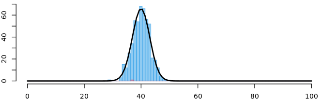

# Limit theorems

```{js, echo=F}
function checkAnswer_mmc(q) {
      const selectedOptions = document.querySelectorAll('input[name="option'+q.id+'"]:checked');
      if (selectedOptions.length === 2) {
        const userAnswers = Array.from(selectedOptions).map(option => option.value);
        const correctAnswers = q.answer;
        const isCorrect = userAnswers.every(answer => correctAnswers.includes(answer));

if (isCorrect) {
          document.getElementById('result'+q.id).textContent = 'Congratulations! Your answer is correct.';
          document.getElementById('result'+q.id).style.color = "green";
        } else {
          document.getElementById('result'+q.id).textContent = `Sorry, incorrect.`;
          document.getElementById('result'+q.id).style.color = "red";
        }
      } else {
        document.getElementById('result'+q.id).textContent = 'Please select two options.';
      }
    }
// numeric
function generateQuestion_num(id) {
      // Generate two random numbers between 2 and 10
      const num1 = Math.floor(Math.random() * 10) + 2;
      const num2 = Math.floor(Math.random() * 10) + 2;
      const x1 = Math.floor(Math.random() * 100) + 2;
      const x2 = Math.floor(Math.random() * 100) + 2;
      const x3 = Math.floor(Math.random() * 100) + 2;
      const x4 = Math.floor(Math.random() * 100) + 2;
      const x5 = Math.floor(Math.random() * 100) + 2;
      const x6 = Math.floor(Math.random() * 100) + 2;

       // Calculate the correct answer
      let answer = num1*Math.sqrt(x1) + num2*Math.sqrt(x2);


      // Return the question and answer as an object
      return {
       // question: num1 + "\\(\\sqrt{x}+\\)"+ num2 + "\\(\\sqrt{y}\\)" + " for \\(x=\\)" + x1 + " and \\(y=\\)" + x2,
        question: [num1,num2,x1,x2,x3,x4,x5,x6],
        answer: answer,
        id: id
      };
    }

function checkAnswer_num(q) {
      const userAnswer = document.getElementById('answer'+q.id).value;
      const isCorrect = Math.round(parseFloat(userAnswer)*10000)/10000 === Math.round(q.answer*10000)/10000;

      if (isCorrect) {
        document.getElementById('result'+q.id).textContent = 'Congratulations! Your answer is correct.';
        document.getElementById('result'+q.id).style.color = "green";
      } else {
        document.getElementById('result'+q.id).textContent = `Sorry, incorrect. The correct answer is ` + Math.round(q.answer*10000)/10000 + '.';
        document.getElementById('result'+q.id).style.color = "red";
      }
  }

// plain multiple choice
  function checkAnswer_match(q) {
      const selectedOption = document.querySelector('input[name="option'+q.id+'"]:checked');
      if (selectedOption) {
        const userAnswer = selectedOption.value;
        const isCorrect = userAnswer === q.answer;

        if (isCorrect) {
          document.getElementById('result'+q.id).textContent = 'Congratulations! Your answer is correct.';
          document.getElementById('result'+q.id).style.color = "green";
        } else {
          document.getElementById('result'+q.id).textContent = `Sorry, incorrect.`;
          document.getElementById('result'+q.id).style.color = "red";
        }
      } else {
        document.getElementById('result'+q.id).textContent = 'Please select an option.';
      }
    }
    
function factorial(n){
  let answer = 1;
  if (n == 0 || n == 1){
    return answer;
  }
  else if(n > 1){
    for(var i = n; i >= 1; i--){
      answer = answer * i;
    }
    return answer;
  }
  else{
    return "number has to be positive."
  }  
}

function binomial(n, k) {
     if ((typeof n !== 'number') || (typeof k !== 'number')) 
  return false; 
    var coeff = 1;
    for (var x = n-k+1; x <= n; x++) coeff *= x;
    for (x = 1; x <= k; x++) coeff /= x;
    return coeff;
}

function binomialCDF(k,n,p) {
    let answer = 0;

    for(var i = 0; i <= k; i++){
      answer = answer + binomial(n,i)*Math.pow(p,i)*Math.pow((1-p),(n-i));
    }
    return answer;
}

function normalCDF(x, mean, std) {
  var x = (x - mean) / std
  var t = 1 / (1 + .2315419 * Math.abs(x))
  var d =.3989423 * Math.exp( -x * x / 2)
  var prob = d * t * (.3193815 + t * ( -.3565638 + t * (1.781478 + t * (-1.821256 + t * 1.330274))))
  if( x > 0 ) prob = 1 - prob
  return prob
}
```


We've already seen that **empirical**$\not=$**theoretical**, at least not entirely. How then are we supposed to understand anything about the population based on a sample?

Well, fortunately there are mathematical guarantees that at least in the limit, i.e. as our sample size gets larger and larger, we get closer and closer to the truth.

***

In this chapter we will learn:
  
- What two important limit theorems there are and
- what implications arise for our analyses.


***

## Strong law of large numbers `r emoji::emoji("flexed_biceps")`


Let $X_1,X_2,\ldots$ be a sequence of independent, identically distributed random variables with $\mathbb E(X_i)=\mu$ and $\text{Var}(X_i)=\sigma^2<\infty$. Then the following applies:
\begin{equation*}
\lim_{n\rightarrow\infty} \frac{1}{n}\sum _{i=1}^n X_i =\mathbb E(X)=\mu\quad\text{ almost sure}.
\end{equation*}
“almost sure” is equivalent to “with probability $1$”.

***

::: {.example #probvshaeuf name="empirical frequencies"}

Using independent repetitions of a stochastic experiment, estimate probability $\mathbb P(A)$ for the occurrence of an event $A,$ given the sample $x_1, x_2, \ldots, x_k,\ldots$

Let $\displaystyle X_k =\begin{cases}1,&\text{ for } x_k\in A\\0 &\text{ for } x_k\not\in A\end{cases}$ **i**ndependent and **i**dentically **d**istributed - **iid** - random variables.

- $\displaystyle\frac{1}{n} \sum_{k=1}^n X_k =h_n(A)=$ relative frequency of occurrence of $A$
- $\mathbb E(X_k)=\mathbb P(A)$ for all $k$
    
According to the law of large numbers:
\[h_n(A) \rightarrow \mathbb P(A)\text{ almost sure}.\]


```{r, echo=FALSE,out.width="100%"}
#htmltools::tags$iframe(title = "GGZ", src ="http://learning-dashboard.lehre.hwr-berlin.de:3838/Apps_RBook/#section-ggz", width=760, height=500)
```

```{r, echo=FALSE,out.width="100%"}
#htmltools::tags$iframe(title = "GGZ", src="http://learning-dashboard.lehre.hwr-berlin.de:3838/Apps_RBook/#section-wahrscheinlichkeiten",  width=760, height=700)
```

:::

With the strong **L**aw of **L**arge **N**umbers (LLN) we have a guarantee that our sample based estimators eventually converge to the population values when \(n\rightarrow\infty\) (asymptotically).

However, as we will see, the values of our estimators (the estimates) depend on the sample. So, what about the distribution of the estimators? The following Central limit theorem helps us to determine the approximative distribution. 

***

## Central limit theorem

The Central Limit Theorem (ZGS) states that this sum of independent and identically distributed (iid) random variables is **approximately normally distributed**. On this basis we can draw statistical conclusions, e.g. about the distribution of the sample mean over all possible sample realizations!

Let $X_1,X_2, \ldots$ be independent identically distributed random variables with
\begin{equation*}
      \mathbb E(X_i)=\mu\quad\text{ and }\quad
      \text{Var}(X_i)=\sigma^2\text{ with } 0<\sigma^2<\infty.
\end{equation*}

The following applies to the sum of the random variables:
\begin{equation*}
      \color{blue}{\mathbb E\left(\sum _{i=1}^n X_i\right)}=\color{blue}{n\mu}\quad\text{ and }\quad
      \color{red}{\text{Var}\left(\sum_{i=1}^n X_i\right)}=\color{red}{n\sigma^2}.
\end{equation*}


Then the distribution function $F_n(z)=\mathbb P(Z_n\leq z)$ of
    the **standardized sum**:

$$
      Z_n = \frac{\sum_{i=1}^n X_i - \color{blue}{n\cdot \mu}}{\sqrt{\color{red}{n\cdot\sigma^2}}} %= \sum_{i=1}^n \frac{X_i-\mu}{\sigma/{\sqrt{n}}}
$$
 converges for $n\rightarrow\infty$ to $N(z)$ of the **standard normal distribution**:

\begin{equation*}
      F_n(z)\rightarrow N(z) \quad \text{ for }n\rightarrow\infty.
\end{equation*}

That is:
\[Z_n\stackrel{a}{\sim} N(0,1).\]

It follows that for sufficiently large $n$ **the mean is approximately normally distributed**:
\begin{equation*}
    \frac{1}{n}\sum_{i=1}^n X_i\stackrel{a}{\sim} N(\mu,\sigma^2/n).
\end{equation*}

---

<details>
<summary>How to compute the mean and the variance for the sample mean</summary>

Consider a random sample \(X_1,X_2,\ldots,X_n\) of iid random variables with \(\mathbb E(X_i)=\mu\) and \(\text{Var}(X_i)=\sigma^2\) for all $i=1,\ldots, n.$

The sample mean is:
\[\overline X = \frac 1n\sum_{i=1}^nX_i.\]

Using the properties of the expected value:
\[\begin{align}
\mathbb E(\overline X) &= \mathbb E\left(\frac 1n\sum_{i=1}^nX_i\right) 
= \frac 1n\mathbb E\left(\sum_{i=1}^nX_i\right)\\
&= \frac 1n\sum_{i=1}^n\underbrace{\mathbb E\left(X_i\right)}_{=\mu}=\frac 1n \sum_{i=1}^n\mu\\
&= \frac 1n \cdot n\cdot \mu = \mu.
\end{align}\]

\[\begin{align}
\text{Var}(\overline X) &= \text{Var}\left(\frac 1n\sum_{i=1}^nX_i\right) 
= \left(\frac 1n\right)^\color{red}{2}\cdot\text{Var}\left(\sum_{i=1}^nX_i\right)\\
&\stackrel{X_i iid}{=} \frac {1^2}{n^2}\cdot \sum_{i=1}^n\underbrace{\text{Var}\left(X_i\right)}_{=\sigma^2}=\frac 1{n^{2}} \sum_{i=1}^n\sigma^2\\
&= \frac 1{n^2} \cdot n\cdot \sigma^2 = \frac{\sigma^2}{n}.
\end{align}\]
</details>

---

<!--
### Approximation von binomialverteilten Zufallsvariablen


- Gegeben: Zufallsvariable $X\sim B(n,p)$ mit hinreichend großem $n$.

- Folgerung: $X=\displaystyle\sum_{k=1}^n X_k$ mit 

    - $X_1,\ldots, X_n$ iid (unabhängig, identisch verteilt)    $B(1,p)$-verteilt (Bernoulli)
    - $\mathbb E(X_k)=p$ und $\text{Var}(X_k)=p(1-p)$ für $k=1,\ldots, n$ 
    
- $\displaystyle\frac{X-np}{\sqrt{np(1-p)}}$ ist approximativ $N(0,1)$-verteilt

- $\displaystyle\mathbb P(a\leq X\leq b)\approx N\left(\frac{b-np}{\sqrt{np(1-p)}}\right) -N\left(\frac{a-np}{\sqrt{np(1-p)}}\right)$

- Approximation wird besser, wenn Treppenfunktion der Binomialverteilung von Normaldichte in der Mitte getroffen wird. 

- $\displaystyle\mathbb P(a\leq X\leq b)\approx N\left(\frac{b+0,5-np}{\sqrt{np(1-p)}}\right) -N\left(\frac{a-0,5-np}{\sqrt{np(1-p)}}\right)$


***

::: {.example #zgs1 name="Anzahl von App-Nutzern bei einer Befragung"}


Bei einer Befragung von $20$ Kunden möchte man die Anzahl der dabei befragten App-Nutzern modellieren.
$A: \text{Anzahl von App-Nutzern unter den 20 Befragten}$, da $\mathbb P(App) = 0,6$ gilt $A\sim B(n=20,p=0,6)$. Wir bestimmen die Wahrscheinlichkeit $\mathbb P(10\leq A\leq 15)$.

- Exakt: $\displaystyle \mathbb P(10\leq A\leq 15) = \mathbb P(A=10) + \mathbb P(A=11) + \ldots + \mathbb P(A=15) = `r gsub("\\.","\\,",round(pbinom(15,20,0.6) - pbinom(9,20,0.6),4))`.$ 

- Einfache Approximation: ($\mathbb E(A)=12$, $\text{Var}(A) = 4,8$)
      $\displaystyle \mathbb P(10\leq A\leq 15)\approx N\left(\frac{15-12}{\sqrt{ 4,8}} - N\left(\frac{10-12}{\sqrt{4,8}}\right)\right) = `r gsub("\\.","\\,",round(pnorm(15,12,sqrt(4.8)) - pnorm(10,12,sqrt(4.8)),4))`$

- Mit Stetigkeitskorrektur:
\begin{align*}
          \displaystyle \mathbb P(10\leq A\leq 15)&=\mathbb P(9,5<A<15,5)\\
&\approx N\left(\frac{15,5-12} {\sqrt{4,8}} - N\left(\frac{9,5-12}{\sqrt{4,8}}\right) \right) \\
            & = `r gsub("\\.","\\,",round(pnorm(15.5,12,sqrt(4.8)) - pnorm(9.5,12,sqrt(4.8)),4))`
\end{align*}

:::

***
-->

::: {.example #zgs2 name="Average time in the online shop"}

In examples \@ref(exm:stZV) and \@ref(exm:stZVkenz) we have modelled $X=$"time in the online shop" as a continuous random variable with the density:

$$
f(x) = \begin{cases}`r parss[1]`\cdot x `r parss[2]`, &\text{ für } `r aa`\leq x\leq `r cc`,\\
                      `r parss[3]` `r parss[4]`\cdot x, &\text{ für } `r cc`< x\leq `r bb`.\end{cases}
$$


```{r,echo=F,fig.cap='Density function of X=time in the online shop', out.width='40%', fig.asp=.75, fig.align='center'}
xwert<-60
a=0; b=100; c=20
x<-seq(a,b,0.1)

fx<-function(x,a=0,b=2,c=0.7){
    if(x>c&x<=b){
      px<-(2*(b-x))/((b-a)*(b-c))
    } else if (x>=a&x<=c){
      px<-(2*(x-a))/((b-a)*(c-a))
    } else {
      px<-0
    }
    return(px)
}


top<-2/(b-a); topp<-gsub("\\.","\\,",round(top,4))
px<-sapply(x,fx,a=a,b=b,c=c)
  
plot(x,px,lwd=2,col=4,type="l",axes=F,ylab="f(x)",ylim=c(0,0.02))
axis(1)
axis(2,at=c(0,0.01,top,0.02),labels=c(0,"0,01",topp,"0,02"),cex.axis=0.8)
abline(v=c,lty=2,col="gray44")
abline(h=0,lty=2,col="gray44")

```

and computed: 

\begin{align}
\mathbb E(X) &= `r myintt`,\\
\text{Var}(X) &= `r myintt5`.
\end{align}

Now we draw a pair of samples of size $n$ from this distribution and in each sample realization we take the average of the values. The ZGS states that (although the individual times are obviously **not** normally distributed) the distribution of the (standardized) average will get closer and closer to the (standard) normal distribution as $n$ increases.

That is, $\bar X=\frac 1n(X_1 + \ldots + X_n)$ mit $\mathbb E(\bar X) = n\cdot \frac 1n\cdot \mathbb E(X) = `r myintt`$ und $\text{Var}(\bar X)=n\cdot\frac1{n^2}\cdot \text{Var}(X) = \frac{`r myintt5`}{n}.$

```{r, echo=FALSE,out.width="100%"}
#htmltools::tags$iframe(title = "GGZ", src ="http://learning-dashboard.lehre.hwr-berlin.de:3838/Apps_RBook/#section-zgs",  width=760, height=700)
```


For $n=50$ holds:

$$
\bar X\stackrel{a}{\sim} N(40;9,3333)
$$

and

$\mathbb P(35\leq\bar X\leq 45)\stackrel{\sim}{=}N(\frac{45-40}{\sqrt{9,3333}}) - N(\frac{35-40}{\sqrt{9,3333}}) =`r gsub("\\.","\\,",round(pnorm(45,40,sqrt(9.3333)) - pnorm(35,40,sqrt(9.3333)),4))`$



:::

***

::: {#q41 .quiz }

<p id="question"> <span id="question-text41"></span>
<input type="number" id="answer41" placeholder="Enter your answer"> and
<button onclick="checkAnswer_num(questionObj41)">Submit</button></p>
<p id="result41"></p>


```{js,echo=F}

 const questionObj40 = generateQuestion_num(40);
 // Generate a random question
    const questionObj41 = generateQuestion_num(41);
// Display the question
    document.getElementById('question-text41').textContent = "We want to model the invoice amount (Rechnungshöhe) of  \\(i\\)th customer as a random variable \\(R_i\\)  and then model the average invoice amount of  \\(n\\)  customers  \\(\\bar R=\\frac 1n\\sum_{i=1}^nR_i.\\) We assume that the invoice amounts of different customers \\(R_1,\\ldots,R_n\\) are independently and identically distributed with  \\(\\mathbb E(R_i)=" + (questionObj41.question[0]*10) + "\\)  and \\(\\text{Var}(R_i)=" + (questionObj41.question[1]*100) + "\\) but the actual distribution is unknown.\\[\\] Every day, over several days, we calculate the daily average of the invoice amounts of  \\(n=" + (questionObj40.question[0]*10) + "\\) randomly selected customers. How is the average invoice amount approximately distributed?\\[\\]\\(\\bar R\\) is approximately normal distributed with \\[\\]\\(\\mu=\\)";
    questionObj41.answer = (questionObj41.question[0]*10)
```


<p id="question"> <span id="question-text42"></span>
<input type="number" id="answer42" placeholder="Enter your answer">.
<button onclick="checkAnswer_num(questionObj42)">Submit</button></p>
<p id="result42"></p>


```{js,echo=F}

 // Generate a random question
    const questionObj42 = generateQuestion_num(42);
// Display the question
    document.getElementById('question-text42').textContent = "\\(\\sigma^2=\\)";
    questionObj42.answer = (questionObj41.question[1]*100)/(questionObj40.question[0]*10)
```


<p id="question"> <span id="question-text43"></span>
<input type="number" id="answer43" placeholder="Enter your answer">
<button onclick="checkAnswer_num(questionObj43)">Submit</button></p>
<p id="result43"></p>


```{js,echo=F}

 // Generate a random question
    const questionObj43 = generateQuestion_num(43);
// Display the question
    document.getElementById('question-text43').textContent = "Based on the approximative normal distribution, we can calculate \\(\\mathbb P("+(questionObj41.question[0]*10- questionObj43.question[0]) + "\\leq \\bar R\\leq"+ (questionObj41.question[0]*10+ questionObj43.question[1]) + ")\\approx \\)";
    
    questionObj43.answer = normalCDF((questionObj41.question[0]*10+ questionObj43.question[1]), (questionObj41.question[0]*10), Math.sqrt((questionObj41.question[1]*100)/(questionObj40.question[0]*10))) - normalCDF((questionObj41.question[0]*10- questionObj43.question[0]), (questionObj41.question[0]*10), Math.sqrt((questionObj41.question[1]*100)/(questionObj40.question[0]*10)))
```

:::


<!--::: {.exercise name="CLT for the average invoice amount (Rechnungshöhe)"}

We want to model the invoice amount of $i$th customer as a random variable $R_i$ and then model the average invoice amount of $n$ customers ($\bar R = \frac 1n\sum_{i=1}^n R_i$). . We assume that the invoice amounts of different customers ($R_1,\ldots, R_n$) are independently and identically distributed with $\mathbb E(R_i) = 30$ and $\text{Var}(R_i) = 900$, but the actual distribution is unknown.

Every day, over several days, we calculate the daily average of the invoice amounts of $n=100$ from randomly selected customers.
**How is the average invoice amount approximately distributed?**

```{r, echo=FALSE,out.width="100%"}
htmltools::tags$iframe(title = "Aufgabe_ZGS", src ="./htmls/Aufgabe_ZGS.html",  width=760, height=500)
```

:::-->

***

<!--
## Rückblick{-}

```{r, echo=FALSE,out.width="100%"}
htmltools::tags$iframe(title = "Wortwolke", src ="http://learning-dashboard.lehre.hwr-berlin.de:3838/Apps_RBook/#section-wortwolke",  width=760, height=600)
```
-->
