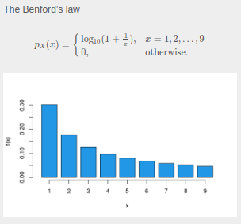

```{r setup, include=FALSE}

require(RAppArmor)     # auf Server notwendig für abgesicherte Codeausführung in Übungen
library(learnr)
library(gradethis)

rmarkdown::find_pandoc(cache = FALSE)
knitr::opts_chunk$set(echo = FALSE)

gradethis_setup()


x<-seq(1,9) # construct a number sequence 1,2,...,9 for the X-values
probs<-log10(1 + 1/x) # compute the probabilities for X-values using the pdf above
tabd<-rbind(x,probs) 

digits = c(7,2,3,6,8,
            1,1,2,3,3,
            1,3,9,1,2,
            2,1,3,3,3,
            8,4,2,2,6,
            1,1,1,1,1,
            1,1,1,2,2,
            2,1,5,1,2,
            1,1,5,7,2,
            3,4,4,3,4
            )

#frequencies
freqs = table(digits)
#probabilities
x = seq(from=1,to=9,by=1) # construct a number sequence 1,2,...,9 for the X-values
probs = log10(1 + 1/x)

#chi2
n = 50
chi2 = sum((freqs - probs*n)^2/(probs*n))

```

```{css}
div.app {
  background-color:rgb(230, 231, 232);
  padding:20px 20px;
  margin-top:10px;
  margin-bottom:10px;
  margin-right:10px;
  margin-left:10px;
  border:1px solid black;
}

div.cody {
  background-color:#C5E4F6;
  padding:20px 20px;
  margin-top:10px;
  margin-bottom:10px;
  margin-right:10px;
  margin-left:10px;
  border:1px solid black;
}

div.example {
  background-color:#C5E4F6;
  padding:20px 20px;
  margin-top:10px;
  margin-bottom:10px;
  margin-right:10px;
  margin-left:10px;
  border:1px solid black;
}

div.resources {
  background-color:rgb(247, 251, 242);
  padding:20px 20px;
  margin-top:10px;
  margin-bottom:10px;
  margin-right:10px;
  margin-left:10px;
  border:1px solid black;
}

div.exercise {
  background-color:rgb(247, 251, 242);
  padding:20px 20px;
  margin-top:10px;
  margin-bottom:10px;
  margin-right:10px;
  margin-left:10px;
  border:1px solid black;
}
details summary { 
  cursor: pointer;
}

details summary > * {
  display: inline;
}

```

::: tracking_consent_text

Consent form
<br>
This website uses cookies to store user preferences and the status of the learning application that has already been processed. Furthermore, your interactions with the learning application as cursor movements, clicks and inputs are collected for research purposes. By continuing to use the website, you agree to this use.

:::

::: data_protection_text

Data protection information obligations regarding data collection in the “MultiLA” research project in accordance with Art. 13 GDPR
The project "Multimodal Interactive Learning Dashboards with Learning Analytics" (MultiLA) aims to research learning behavior in the learning applications provided. For this purpose, data is collected and processed, which we will explain below.

1. Name and contact details of the person responsible
Berlin University of Technology and Economics
Treskowallee 8
10318 Berlin

T: +49.40.42875-0

Represented by the President
Praesidentin@HTW-Berlin.de

2. Data protection officer
Official data protection officer
Vitali Dick (HiSolutions AG)
datenschutz@htw-berlin.de

Project manager
Other leg jerkers
andre.beinrucker@htw-berlin.de

3. Processing of personal data
3.1 Purpose
The processing of personal data serves the purpose of analyzing learning behavior and the use of interactive learning applications as part of the “MultiLA” research project.

3.2 Legal basis
The legal basis is Article 6 Paragraph 1 Letter e GDPR.

3.3 Duration of storage
All data is recorded only within the learning application. They are stored on the HTW-Berlin servers and will be deleted when the project or possible follow-up projects expire.

4. Your rights
You have the right to receive information from the university about the data stored about you and/or to have incorrectly stored data corrected.
You also have the right to delete or restrict processing or to object to processing.
In addition, if you have given consent as the legal basis for the processing, you have the right to withdraw your consent at any time. The lawfulness of processing based on consent until its revocation remains unaffected. In this case, please contact the following person: Andre Beinrucker, andre.beinrucker@htw-berlin.de.
You have the right to lodge a complaint with a supervisory authority if you believe that the processing of your personal data violates the law.
5. Information about your right to object according to Art. 21 Paragraph 1 GDPR
You have the right, for reasons arising from your particular situation, to object at any time to the processing of data concerning you, which is carried out on the basis of Article 6 Paragraph 1 Letter e of the GDPR (data processing in the public interest).

:::

## Goodness-of-fit tests

Recall our first case study, where we modeled the first digits of numbers with Benford's law. 

 

Indeed, we got a similar empirical distribution of the first digits in a sample of prices. However, the empirical frequencies were not *exactly* the same as the probabilities of the Beford's law. So, in fact, one could **question the applicability** of the distribution model to the data. In such situation, the so-called goodness-of-fit tests can help.

**Goodness-of-fit tests** check whether the actual distribution of a sample corresponds to a *given* distribution model. Before we assess the goodness of fit for prices distribution, let us first understand such tests using a simple example with dice.

::: {.example #dice name="Dice"}

**Rolling Dice**

After rolling a die $1000$ times, the following contingency table results:

  \begin{equation*}
      \begin{array}[t]{l|cccccc}
        \hline 
        \text{number}& 1 & 2 & 3 & 4 & 5 & 6\\
        \text{frequency} & 162 & 160 & 166 & 164 & 170 &
                                                              178\\\hline 
      \end{array}
    \end{equation*}

Is the die fair?
  In other words: Is the observed deviation the
    dice numbers of $166.66$ (equal probabilities) significant?
    
:::

```{r q0}
question_checkbox(
  "What is the reference model for rolling a die experiment, that we want to check the goodness of fit for?",
  answer("A discrete uniform distribution", correct = TRUE),
  answer("All values have equal probabilities", correct = TRUE),
  answer("The Benford's law"),
  answer("A binomial distribution"),
  answer("A discrete distribution with unequal probabilities"),
  answer("A normal distribution"),
  random_answer_order = TRUE,
  allow_retry = TRUE
)
```

::: {.resources #chi2 name="chi2 test"} 

**$\chi^2$-Goodness-of-fit test** (for discrete random variables with finite number of values) 

Given $n$ independent repetitions
    $X_1,\ldots, X_n$ of a random variable $X$ with values
    $\{a_1,\ldots, a_k\}$ and their frequencies $h_i$ in a sample:
    \begin{equation*}
      \begin{array}[t]{l|cccc}
        \hline %
        \text{values of }X & a_1 & a_2 & \cdots & a_k\\
        \text{absolut frequencies} & H_1 & H_2 & \cdots & H_k\\\hline
      \end{array}
    \end{equation*}

- The assumed distribution is formulated as a null hypothesis:
    \begin{equation*}
      H_0:  \mathbb P(X=a_i) = p_i,\quad  \text{ for all } i=1,\ldots, k. 
    \end{equation*}
- Alternative hypothesis: $H_1: \mathbb P(X=a_i)\not=p_i$ for at least one $i$.

- Summing up the standardized deviations from the target values provides the test statistics:
    \begin{equation*}
      \chi^2 = \sum_{i=1}^k \frac{(H_i-n p_i)^2} {n p_i}
    \end{equation*}
    
- For large $n$ ($n\rightarrow\infty)$ the test statistics $\chi^2$ is approximately $\chi^2$-distributed with $k-1$ degrees of freedom
 under $H_0$. (The number of degrees of freedom decreases
      additionally with the number of the estimated distribution parameters.)
    
- For a concrete sample, we have realizations of absolute frequencies $h_i, i=1, \ldots ,k$ and compute the values of the test statistics above:
  \begin{equation*}
      \hat\chi^2 = \sum_{i=1}^k \frac{(h_i-n p_i)^2} {n p_i}
    \end{equation*}


- $H_0$ is rejected whenever the realized value of the test statistics $\hat\chi^2$ falls greater than the critical value $\chi^2_{1-\alpha(k-1)}$.


<!--

- Assumption: $X_1,\ldots, X_n$ independent, identically distributed
      to $X\in \{a_1,\ldots, a_k\}$

- Hypotheses:
      \begin{minipage}[t]{.7\linewidth}
        \begin{align*}
          H_0:&\quad \p(X=a_i)=\pi_i,\quad i=1,\ldots, k,\\
          H_1:&\quad \p(X=a_i)\not=\pi_i,\quad \text{ for at least one }i
        \end{align*}
      \end{minipage}

- Test statistics: $\displaystyle \chi^2 = \sum_{i=1}^k
      \frac{(h_i-n\pi_i)^2}{n\pi_i}$

- Distribution under $H_0$: approximate
      $\chi^2(k-1)$ (The number of degrees of freedom decreases
      additionally with the number of estimated distribution parameters)
    -->
:::

```{r q1}

question_numeric( "In the rolling dice example above $k=$...",
                  answer(6, correct=TRUE),
                  correct = "Correct!",
                  incorrect = "Incorrect",
                  allow_retry = TRUE,
                  tolerance = 10^(-4)
)

```

```{r q2}

question_numeric( "In the rolling dice example above $n=$...",
                  answer(1000, correct=TRUE),
                  correct = "Correct!",
                  incorrect = "Incorrect",
                  allow_retry = TRUE,
                  tolerance = 10^(-4)
)

```

```{r q3}

question_numeric( "In the rolling dice example above $h_4=$...",
                  answer(164, correct=TRUE),
                  correct = "Correct!",
                  incorrect = "Incorrect",
                  allow_retry = TRUE,
                  tolerance = 10^(-4)
)

```

```{r q4}

question_numeric( "In the rolling dice example above $p_1=\\ldots=p_6=$...",
                  answer(1/6, correct=TRUE),
                  correct = "Correct!",
                  incorrect = "Incorrect",
                  allow_retry = TRUE,
                  tolerance = 10^(-4)
)

```

::: {.example #dice name="Dice"}

**Rolling Dice**

In the dice example we get the test statistic:
    \begin{equation*}
      \chi^2 = \sum_{i=1}^6 \frac{(h_i - 1000\cdot 1/6)^2} {1000\cdot
        1/6} = \frac{32}{25} = 1.28.
    \end{equation*}
If you choose $\alpha=0.1$, you get
    \begin{equation*}
      1.28 < \chi^2_{0.9(5)} = 9.2364,
    \end{equation*}
  i.e. the null hypothesis cannot be rejected.

:::

::: summary

#### $\chi^2$-Goodness-of-fit test

- Hypothesis:
    \begin{equation*}
      H_0:  \mathbb P(X=a_i) = p_i,\quad  \text{ for all } i=1,\ldots, k \text{ vs. } H_1: \mathbb P(X=a_i)\not=p_i$ \text{ for at least one } $i$
    \end{equation*}

- Test statistics:
    \begin{equation*}
      \chi^2 = \sum_{i=1}^k \frac{(H_i-n p_i)^2} {n p_i}\sim\chi^2_{(k-1)}
    \end{equation*}

- Test statistics value based on sample frequencies $h_i$:
\begin{equation*}
      \hat\chi^2 = \sum_{i=1}^k \frac{(h_i-n p_i)^2} {n p_i}
    \end{equation*}
    
- Rejection region:
  \begin{equation*}
      \hat\chi^2 > \chi^2_{1-\alpha(k-1)}
    \end{equation*}
:::

## Goodness-of-fit: Benford's law for prices

Now we test, whether the distribution induced by Benford's law is appropriate for the sample of $50$ prices in our first case study.

::: {.exercise #ex1 name="Goodness-of-fit test"}

Recall, that we computed the following probabilities for the Benford's law:

\[\begin{array}{rrrrrrrrrr}
  \hline
 x_i& 1 & 2 & 3 & 4 & 5 & 6 & 7 & 8 & 9 \\ 
  \hline
  p_i& 0.30 & 0.18 & 0.12 & 0.10 & 0.08 & 0.07 & 0.06 & 0.05 & 0.05 \\ 
   \hline
\end{array}\]

Later on, we also computed the sample frequencies:

```{r, echo=F}
#xtable::xtable(t(tabfr))
```

\[\begin{array}{rrrrrrrrrr}
  \hline
a_i & 1 & 2 & 3 & 4 & 5 & 6 & 7 & 8 & 9 \\ 
  \hline
h_i &  17 &  11 &   9 &   4 &   2 &   2 &   2 &   2 &   1 \\ 
   \hline
\end{array}\]

Conduct the $\chi^2$ goodness-of-fit test for the sample.

- Determine the values:

```{r q12}

question_numeric( "In this case, $k=$...",
                  answer(9, correct=TRUE),
                  correct = "Correct!",
                  incorrect = "Incorrect",
                  allow_retry = TRUE,
                  tolerance = 10^(-4)
)

```

```{r q22}

question_numeric( "In this case, $n=$...",
                  answer(50, correct=TRUE),
                  correct = "Correct!",
                  incorrect = "Incorrect",
                  allow_retry = TRUE,
                  tolerance = 10^(-4)
)

```

```{r q32}

question_numeric( "In this case, $h_4=$...",
                  answer(4, correct=TRUE),
                  correct = "Correct!",
                  incorrect = "Incorrect",
                  allow_retry = TRUE,
                  tolerance = 10^(-4)
)

```

```{r q42}

question_numeric( "In this case, $p_4=$...",
                  answer(0.1, correct=TRUE),
                  correct = "Correct!",
                  incorrect = "Incorrect",
                  allow_retry = TRUE,
                  tolerance = 10^(-4)
)

```

- Compute the values of the test statistics. You can use the following R-chunk to do that:

```{r chih, exercise=TRUE, exercise.eval=TRUE}

```

```{r chih-hint}
#frequencies
freqs = c(17,11,9,4,2,2,2,2,1)
#probabilities
x = seq(from=1,to=9,by=1) # construct a number sequence 1,2,...,9 for the X-values
probs = log10(1 + 1/x)

#chi2
n = 50
chi2 = sum((freqs - probs*n)^2/(probs*n))
chi2
```


```{r q5}

question_numeric( "In this case, $\\hat\\chi^2=$...",
                  answer(4.797864, correct=TRUE),
                  correct = "Correct!",
                  incorrect = "Incorrect",
                  allow_retry = TRUE,
                  tolerance = 10^(-4)
)

```

- Compute the $p$-value, i.e. $\mathbb P(\chi^2 >\hat\chi^2)$ using the $\chi^2$ distribution with $k-1$ degrees of freedom under $H_0$. You can use the function `pchisq(x, df)` to compute the values of the cumulative distribution function of $\chi^2$ distribution at `x` with `df` degrees of freedom.

```{r pval, exercise=TRUE, exercise.eval=TRUE}

```

```{r pval-hint}

pval = 1 - pchisq(chi2,8)
pval

```


```{r q6}

question_numeric( "In this case, $p-$value is ...",
                  answer(0.7789461, correct=TRUE),
                  correct = "Correct!",
                  incorrect = "Incorrect",
                  allow_retry = TRUE,
                  tolerance = 10^(-4)
)

```

- Test decision:

```{r q7}
question_checkbox(
  "The test decision is",
  answer("Do not reject the null hypothesis.", correct = TRUE),
  answer("The sample speaks for using the Benford's law as an model for the first digits of the prices.", correct = TRUE),
  answer("The sample speaks against using the Benford's law as an model for the first digits of the prices."),
  answer("Reject the null hypothesis"),
  answer("We do not reject the null hypothesis, hence the Beford's law is not suitable."),
  answer("We reject the null hypothesis, hence the Beford's law is not suitable."),
  random_answer_order = TRUE,
  allow_retry = TRUE
)
```
:::
