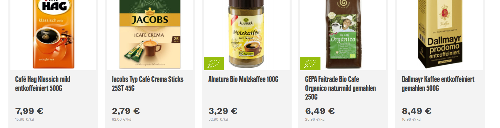

```{r setup, include=FALSE}

require(RAppArmor)     # auf Server notwendig für abgesicherte Codeausführung in Übungen
library(learnr)
library(gradethis)

rmarkdown::find_pandoc(cache = FALSE)
knitr::opts_chunk$set(echo = FALSE)

gradethis_setup()

prices<-c(7.99,2.79,3.29,6.49,8.49,
          10.99,10.99,2.99,3.49,3.99,
          11.99,3.49,9.49,18.99,2.59,
          2.69,1.99,3.29,3.99,3.79,
          8.99,4.79,2.49,23.99,6.49,
          1.69,1.69,1.49,1.19,1.99,
          1.75,1.29,1.29,2.79,2.79,
          2.09,1.59,5.49,1.89,2.79,
          1.39,1.49,5.99,7.49,2.29,
          3.29,4.99,4.59,3.79,4.29)
lprices<-log(prices)
m<-mean(lprices)
s<-sd(lprices)
```

```{css}
div.app {
  background-color:rgb(230, 231, 232);
  padding:20px 20px;
  margin-top:10px;
  margin-bottom:10px;
  margin-right:10px;
  margin-left:10px;
  border:1px solid black;
}

div.cody {
  background-color:#C5E4F6;
  padding:20px 20px;
  margin-top:10px;
  margin-bottom:10px;
  margin-right:10px;
  margin-left:10px;
  border:1px solid black;
}

div.resources {
  background-color:rgb(247, 251, 242);
  padding:20px 20px;
  margin-top:10px;
  margin-bottom:10px;
  margin-right:10px;
  margin-left:10px;
  border:1px solid black;
}

div.exercise {
  background-color:rgb(247, 251, 242);
  padding:20px 20px;
  margin-top:10px;
  margin-bottom:10px;
  margin-right:10px;
  margin-left:10px;
  border:1px solid black;
}

details summary { 
  cursor: pointer;
}

details summary > * {
  display: inline;
}

```

::: tracking_consent_text

Consent form
<br>
This website uses cookies to store user preferences and the status of the learning application that has already been processed. Furthermore, your interactions with the learning application as cursor movements, clicks and inputs are collected for research purposes. By continuing to use the website, you agree to this use.

:::

::: data_protection_text

Data protection information obligations regarding data collection in the “MultiLA” research project in accordance with Art. 13 GDPR
The project "Multimodal Interactive Learning Dashboards with Learning Analytics" (MultiLA) aims to research learning behavior in the learning applications provided. For this purpose, data is collected and processed, which we will explain below.

1. Name and contact details of the person responsible
Berlin University of Technology and Economics
Treskowallee 8
10318 Berlin

T: +49.40.42875-0

Represented by the President
Praesidentin@HTW-Berlin.de

2. Data protection officer
Official data protection officer
Vitali Dick (HiSolutions AG)
datenschutz@htw-berlin.de

Project manager
Other leg jerkers
andre.beinrucker@htw-berlin.de

3. Processing of personal data
3.1 Purpose
The processing of personal data serves the purpose of analyzing learning behavior and the use of interactive learning applications as part of the “MultiLA” research project.

3.2 Legal basis
The legal basis is Article 6 Paragraph 1 Letter e GDPR.

3.3 Duration of storage
All data is recorded only within the learning application. They are stored on the HTW-Berlin servers and will be deleted when the project or possible follow-up projects expire.

4. Your rights
You have the right to receive information from the university about the data stored about you and/or to have incorrectly stored data corrected.
You also have the right to delete or restrict processing or to object to processing.
In addition, if you have given consent as the legal basis for the processing, you have the right to withdraw your consent at any time. The lawfulness of processing based on consent until its revocation remains unaffected. In this case, please contact the following person: Andre Beinrucker, andre.beinrucker@htw-berlin.de.
You have the right to lodge a complaint with a supervisory authority if you believe that the processing of your personal data violates the law.
5. Information about your right to object according to Art. 21 Paragraph 1 GDPR
You have the right, for reasons arising from your particular situation, to object at any time to the processing of data concerning you, which is carried out on the basis of Article 6 Paragraph 1 Letter e of the GDPR (data processing in the public interest).

:::

## Log-normal distribution for the prices  `r emoji::emoji("money_mouth_face")`

Recall that in our last case study, we modeled the first digit of the sample of supermarket prices with the Benford's law.  This time, let us model the prices as realizations of a continuous random variable $X$ following a continuous distribution law.

What do you think the distribution law should be like? Can it be a normal distribution? An exponential distribution? Or do we need some other distribution to describe the associated random variable appropriately?

Let's look at the histogram of the $50$ prices:

```{r fig0}
x<-seq(0,25,length.out=10000)
mu<-mean(prices)
sig<-sd(prices)
#hist(prices,breaks="FD", freq=F, xlim=c(0,25), ylim=c(0,0.5))
hist(prices,breaks=c(0,1.5,3,5,8,12,16,24), freq=F, xlim=c(0,25), ylim=c(0,0.4), col="gray88", border="gray55", main="Distribution of prices")
mul<-log(mu^2/sqrt(mu^2+sig^2))
sigl<-log(1+sig^2/mu^2)
lines(x, dlnorm(x,mul,sigl), col=2, lwd=2)
lines(x, dexp(x,1/mu),col=3,lwd=2)
lines(x, dnorm(x,mean(prices,sd(prices))), col=4,lwd=2)
legend("topright",col=c("gray44",4,3,2),lty=c(1,1,1,1),legend=c("empirical","normal","exponential","log-normal"))
```

Obviously, log-normal distribution would be the best choice for our model. But what is this "log-normal distribution"?


### Log-normal distribution

 

" a **log-normal (or lognormal) distribution** is a continuous probability distribution of a random variable whose logarithm is normally distributed. Thus, if the random variable \(X\) is log-normally distributed, then \(Y = \ln(X)\) has a normal distribution."

So, 

- if a random variable $X$ is log-normally distributed, then $\ln X$ is normally distributed. 
- Since the function $\ln(\cdot)$ admits only positive values, the log-normal distribution is a suitable model for positive-valued real random variables.

The density of the log-normal distribution for \(x \in(0;\infty)\) is:

\[f(x)=\frac1{x\sigma\sqrt{2\pi}}\cdot e^{-\frac{(\ln x - \mu)^2}{2\sigma^2}}\]

with the resulting \(\mathbb E(X)=e^{\mu+\frac{\sigma^2}2}\) and \(\text{Var}(X)=(e^{\sigma^2}-1)\cdot e^{2\mu +\sigma^2}.\)

Below, you can find the densities of log-normal distributions with different parameter values.

```{r fig00}
x<-seq(0,25,length.out=10000)
mus=c(1,1,2,2)
sigs = c(1,0.5,1,0.5)
plot(x,dlnorm(x,mus[1],sigs[1]),type="l",lwd=2, ylim=c(0,0.4), ylab="f(x)",xlab="x",axes=F)
for(i in 2:length(sigs)){
  lines(x, dlnorm(x,mus[i],sigs[i]), col=i, lwd=2)
}
axis(1); axis(2)
legend("topright",col=1:length(sigs), lty=rep(1,length(sigs)), legend=c(expression(paste(mu, "=", 1, ",",sigma,"=",1)),
                                                                        expression(paste(mu, "=", 1,",", sigma,"=",0.5)),
                                                                        expression(paste(mu, "=", 2, ",",sigma,"=",1)),
                                                                        expression(paste(mu, "=", 2, ",",sigma,"=",0.5))))

```


```{r q0}
question_checkbox(
  "What are the parameters of the log-normal distribution?",
  answer("$\\mu$", correct = TRUE),
  answer("$\\sigma^2$",correct=TRUE),
  answer("$x$"),
  answer("$\\pi$"),
  answer("$e$"),
  random_answer_order = TRUE,
  allow_retry = TRUE
)
```

```{r q1}
question_checkbox(
  "Which of the following holds for a random variable $X$ with a log-normal distribution?",
  answer("It is a discrete distribution"),
  answer("The probability of $X=2$ is zero", correct = TRUE),
  answer("$\\ln X\\sim N(m,s^2)$, where the parameters correspond to the mean and the variance of $\\ln X$", correct =TRUE),
  answer("Parameters of the log-normal distribution correspond to the mean and the variance of $X$"),
  answer("The probability of $X\\leq 2$ corresponds to the area under the density over interval $[0,2]$", correct = TRUE),
  answer("The cumulative distribution function is a step function"),
  answer("This distribution has a density function", correct =TRUE),
  answer("The distribution is right-skewed", correct=TRUE),
  random_answer_order = TRUE,
  allow_retry = TRUE
)
```


 `r emoji::emoji("smiling_face_with_sunglasses")` So, if our prices follow a log-normal distribution, we can apply the **natural logarithm transformation** to the prices and model them subsequently using a normal distribution!  `r emoji::emoji("smiling_face_with_sunglasses")`


## Normal distribution for the log-prices `r emoji::emoji("microscope")`  

Now recall our real sample of $50$ prices for you here (https://www.edeka24.de)

::: summary
#### Log-normal distribution

```{r figs, out.width="100%"}
x<-seq(0,25,length.out=10000)
mu<-mean(prices)
sig<-sd(prices)
#hist(prices,breaks="FD", freq=F, xlim=c(0,25), ylim=c(0,0.5))
hist(prices,breaks=c(0,1.5,3,5,8,12,16,24), freq=F, xlim=c(0,25), ylim=c(0,0.4), col="gray88", border="gray55", main="Distribution of prices")
mul<-log(mu^2/sqrt(mu^2+sig^2))
sigl<-log(1+sig^2/mu^2)
lines(x, dlnorm(x,mul,sigl), col=2, lwd=2)
legend("topright",col=c("gray44",3),lty=c(1,1),legend=c("empirical","log-normal"))
```

\[prices\sim \log N(\mu,\sigma^2)\rightarrow \ln (prices)\sim N(m,s^2)\]

:::

<details>
<summary>A sample of real prices (no intended advertisement). Click here to unfold/fold the data `r emoji::emoji("mobile phone with arrow")`</summary>

{width=50%}
{width=50%}
{width=50%}
{width=50%}
{width=50%}
{width=50%}
{width=50%}
{width=50%}
{width=50%}
{width=50%}

</details>


::: {.exercise #ex1 name="Normal distribution for the log-prices"}

So, if our prices follow a log-normal distribution, we can apply the **natural logarithm transformation** to the prices, which are already added in R as a variable `prices`, and model them subsequently using a normal distribution!

Follow the following steps:

- compute the natural logarithm of the sample prices and call the new variable `lprices`. Use the R-function `log(prices)` or `=LN()` in excel/calc.

If you wish, you can use the following chunk to compute the probability in the question above using R:

```{r q5r, exercise=TRUE, exercise.eval=TRUE}

```

```{r q5r-hint}
lprices = log(prices)
```

::: summary

#### Useful R-functions

- `m = mean(...)` to compute the sample mean,

- `s = sd(...)` to compute the sample standard deviation, 

- `dnorm(x,m,s)` to compute the density in points $x$ modeled with normal distribution with mean $m$ and standard deviation $s$.

- `pnorm(x,m,s)` to compute the the probability $\mathbb P(X\leq x)$ for $X$ following a normal distribution with mean $m$ and standard deviation $s$.

:::

- compute the sample mean `m` and the sample standard deviation `s` of the log-prices:

```{r q6r, exercise=TRUE, exercise.eval=TRUE}

```

```{r q6r-hint}
m = mean(lprices)
s = sd(lprices)
# print out the results
print(paste("the sample mean is",round(m,4),"and the standard deviation is",round(s,4)))
```

```{r q5}

question_numeric( "What number should be the mean of the normal distribution?",
                  answer(mean(lprices), correct=TRUE),
                  correct = "Correct!",
                  incorrect = "Incorrect",
                  allow_retry = TRUE,
                  tolerance = 10^(-4)
)

```

```{r q6}

question_numeric( "What number should be the variance of the normal distribution?",
                  answer(sd(lprices)^2, correct=TRUE),
                  answer(sd(lprices), "this is the standard deviation not the variance"),
                  correct = "Correct!",
                  incorrect = "Incorrect",
                  allow_retry = TRUE,
                  tolerance = 10^(-4)
)

```

- plot the density of the resulting normal distribution. Use R-command `x=seq(from=-5,to=5,by=0.01)` to create a sequence of values, and `fx=dnorm(x,mean=m,sd=s)` to evaluate the density at the values. You can use `plot(x,fx,type="l")` to show a plot.

```{r q7r, exercise=TRUE, exercise.eval=TRUE}

```

```{r q7r-hint}
x = seq(-5,5,0.01) # sequence of values
fx = dnorm(x,m,s) # density at the values
plot(x,fx, type="l") # plot of type "l"=lines
```


- compute the following probabilities according to the log-normal model:

```{r q2}

question_numeric( "What is the probability to observe a log-price $\\leq 3$?",
                  answer(pnorm(3,m,s), correct=TRUE),
                  correct = "Correct!",
                  incorrect = "Incorrect",
                  allow_retry = TRUE,
                  tolerance = 10^(-4)
)

```

```{r q21}

question_numeric( "What is the probability to observe a log-price between $1$ and $3$?",
                  answer(pnorm(3,m,s)- pnorm(1,m,s), correct=TRUE),
                  correct = "Correct!",
                  incorrect = "Incorrect",
                  allow_retry = TRUE,
                  tolerance = 10^(-4)
)

```

```{r q3}

question_numeric( "What is the probability to observe a price $\\leq 3$ Euro?",
                  answer(pnorm(log(3),m,s), correct=TRUE),
                  correct = "Correct!",
                  incorrect = "Incorrect",
                  allow_retry = TRUE,
                  tolerance = 10^(-4)
)

```

```{r q4}

question_numeric( "What is the probability to observe a price between $1$ and $3$ Euro?",
                  answer(pnorm(log(3),m,s)- pnorm(log(1),m,s), correct=TRUE),
                  correct = "Correct!",
                  incorrect = "Incorrect",
                  allow_retry = TRUE,
                  tolerance = 10^(-4)
)

```

If you wish, you can use the following chunk to compute the probability in the question above using R (Note that the function `pnorm(number,m,s)` will compute for $\mathbb P(X\leq ~number)$ for $X\sim N(m,s^2)$).

```{r q8r, exercise=TRUE, exercise.eval=TRUE}

```

```{r q8r-hint}
pnorm(3,m,s)
pnorm(3,m,s)- pnorm(1,m,s)
pnorm(log(3),m,s)
pnorm(log(3),m,s)- pnorm(log(1),m,s)
```

:::
